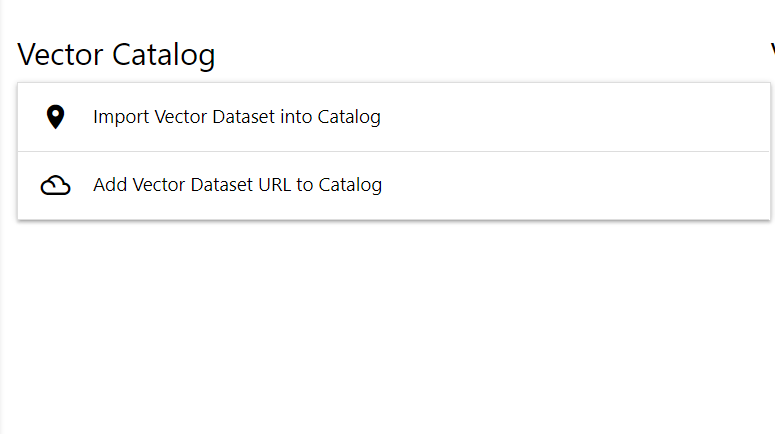
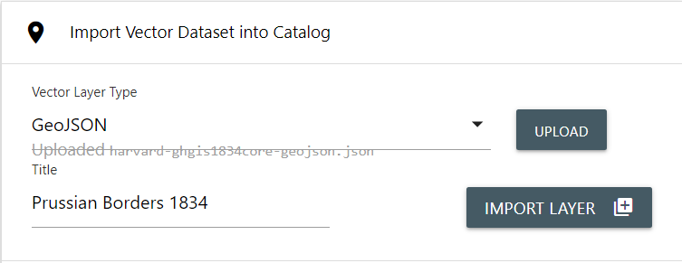

# Editing your SMK application

## Contents

- [Saving and testing your changes](#saving-and-testing-your-changes)
- [Application](#application)
- [Layers](#layers)
- [Layers and Folders](#layers-and-folders)
- [Tools](#tools)

Before this step, you should have an existing SMK application created. If you don't, review [Creating an SMK application](create-an-app.md).

Before you can edit your application, you'll want to open your command line and navigate to the applications folder

```bash
cd /myApplications/mySmkApplication
```

Once you've navigated to your application, you use the SMK-CLI `edit` command.

```bash
smk edit
```

This will launch the SMK-CLI editor in your browser. As part of this process, a mini-api is launched in the background. To prevent issues with any other development servers you may have running, you can optionally supply a port number. The default is `1337`.

```bash
smk edit -p 1337
```

In your command line utility, you'll see some configuration and logging info presented:

```bash
Starting service..
Opening default browser at http://localhost:1337...
Endpoints available:
        GET     /       -> /npm/node_modules/smk-cli/smk-edit/static
        GET     /assets -> ./assets
        GET     /layers -> ./layers
        GET     /module -> /smk-cli/node_modules/smk/dist
        POST    /catalog/asset
        GET     /catalog/asset
        GET     /catalog/asset/:id
        POST    /catalog/local
        GET     /catalog/local
        DELETE  /catalog/local/:id
        PUT     /catalog/local/:id
        GET     /catalog/local/:id
        GET     /catalog/mpcm
        GET     /catalog/mpcm/:id
        GET     /catalog/wms/:url
        GET     /catalog/wms/:url/:id
        POST    /config
        GET     /config
        POST    /convert/csv
        POST    /convert/geojson
        POST    /convert/kml
        POST    /convert/shape
        GET     /ping
Current path is /mySmkProjects/mySmkProject
Base path is ./
Configuration path is ./smk-config.json
Layers catalog path is ./layers
Assets catalog path is ./assets
Temp path is ./.temp
Service listening at http://localhost:1337/
Hit Ctrl-C to exit

2020-09-24T22:12:35.094Z GET /config
    Reading config from /mySmkProjects/mySmkProject/smk-config.json
```

Then your default browser will open to the startup window of the editor:


From this screen you can see a navigation bar on the left which contains the main menus for the editor:


The main menu contains three options:

- Applciation
- Layers
- Tools

By default, the SMK-CLI editor launches with the `Application` menu open, and you can click on any of the options to open up the related screens.

`Application` contains options for configuring the default settings for your map. This is explained in greater detail below in the section "Application"

`Layers` contains options for creating and configuring layers and folders in your application. This is explained in greater detail below in the section "Layers"

`Tools` contains options for adding and configuring tools that can be used in your application. This is explained in greater detail below in the section "Tools"

## Saving and testing your changes

At the bottom of the application is a set of buttons, `save` and `view`.


Click once on the `save` button to save any configuration changes you've made to your application.

Click once on the `view` button to launch your application in a popup window so you can test out any configuration changes you've made. Once you're done, click anywhere outside the popup window to close the view and return to the editor screen.

You can also test your application by building and launching it on a local server. Instructions for deploying your application on the server can be found in the [SMK documentation](https://bcgov.github.io/smk/)

## Application

The Application screen shows you your current settings for the application name and title, and allows you to modify the following settings for your application.

- Map Viewer (Leaflet)
- Device (Auto-detect, Desktop, or Mobile)
- Base map (basemaps from Esri and other sources)

You can use the map on the right to select your applications initial extent. When the application is launched, this is the location that the map will zoom to. By default the extent is a bounding box around British Columbia, Canada.

To change your initial extent and zoom levels, you can pan and zoom the map using your mouse to the desired location using the provided leaflet "slippy" map.

## Layers

The layers screen is more complex then the application screen, containing a default for for your layers and folders, and multiple sub-menu's for loading layers into your application.

For a new application, the layer screen will initially display empty:


To add layers, you'll need to select one of the options in the sub-menus provided on the left-hand menu.


You'll notice that there are three options in the sub-menu:

- Manage DataBC Layers
- Manage WMS Layers
- Manage Vector Layers

### DataBC Layers

`Manage DataBC Layers` allows you to select layers from the [DataBC Layer Catalog](https://catalogue.data.gov.bc.ca/dataset?download_audience=Public). These are Government of British Columbia datasets provided by the BC Geographic Warehouse and contain layers covering a wide range of ministries, business areas and data sets. By default, only publicly accessible layers are provided. An active internet connection is required to load available layers from the DataBC Catalog.


On the left had side of the screen there is a "Filter Catalog" option, and a folder listing of available layers. Because the layer list is quite large, covering hundreds of folder and layer groups, it's best to filter your options down to the datasets you're specifically looking for.

#### Filtering DataBC Layers

To filter the layers, click once on the "Filter Catalog" header. This will open the filter options.


To filter available layers, type your filter text into the "Show Catalog Entries Containing" box and click once on the  button. The layer list will be updated to filter out options that do not match your text search. Some folders with matching layer names may be automatically opened as well.

#### Adding DataBC Layers

Once you've found a layer you wish to add. Double-click on the layer and it will add it to your application. You can see selected layers to the right of the layer listing.


The added DataBC Catalog layers have four options on the bottom-right of the layer panels for working with the layers. These options, from left to right, are 'View in Catalog', 'Show/Hide', 'Edit', and 'Remove'.


`View in catalog` will open a separate browser tab, which displays the DataBC Data Catalog page with information about the layer.

`Show/Hide` is a toggle button that indicates if this layer should be turned on when the application is launched. By default layers are set to hidden.

`Edit` will open an advanced settings popup that allows you to modify the layer details. Please view [Editing a Layer](edit-layer.md) from more information on the layer editing options.

`Remove` will remove the layer from your application. Be careful, as removing a layer will also delete any of your configured settings with that layer.

### WMS Layers

`Manage WMS Layers` allows you to supply a link to a WMS service, and via the service `GetCapabilities` load a listing of available WMS layers to add to your application.


The functionality for WMS layers is identical to that of the DataBC layers described above. At the top of the options you can configure your WMS service URL. There is also a "Filter Catalog" option, and a folder listing of available layers.

#### Setting your WMS URL

By default, the application will set the WMS service URL to the [DataBC Catalog WMS Service](https://openmaps.gov.bc.ca/geo/pub/wms). To change your WMS service, click once on the WMS Selector.


You'll notice that the selector is actually a dropdown select box. SMK-CLI is pre-configured with some additional default WMS Services. These include:

- [DataBC Catalog WMS Service](https://openmaps.gov.bc.ca/geo/pub/wms) (selected by default)
- [Maps.th.gov.bc.ca](https://maps.th.gov.bc.ca/geoV05/ows)
- [NRS GeoServer](https://geo.nrs.gov.bc.ca/pub/geoserver/wms)
- Another WMS Service


To add another WMS service that is not listed in the default options, click once on 'Another WMS Service'. You will be provided with a text box where you can supply the full URL to a new WMS service


Click once on the 'Load Catalog' button to load layers from your provided services `GetCapabilities`

#### Filtering WMS Layers

Filtering WMS layers works identically to the DataBC Layer filtering detailed above. To filter the layers, click once on the "Filter Catalog" header. This will open the filter options.


To filter available layers, type your filter text into the "Show Catalog Entries Containing" box and click once on the  button. The layer list will be updated to filter out options that do not match your text search. Some folders with matching layer names may be automatically opened as well.

#### Adding WMS Layers

Adding layers from a WMS service works identically to the DataBC Layer options. Once you've found a layer you wish to add. Double-click on the layer and it will add it to your application. You can see selected layers to the right of the layer listing.


The added WMS layers have three options on the bottom-right of the layer panels for working with the layers. These options, from left to right, are 'Show/Hide', 'Edit', and 'Remove'.


`Show/Hide` is a toggle button that indicates if this layer should be turned on when the application is launched. By default layers are set to hidden.

`Edit` will open an advanced settings popup that allows you to modify the layer details. Please view [Editing a Layer](edit-layer.md) from more information on the layer editing options.

`Remove` will remove the layer from your application. Be careful, as removing a layer will also delete any of your configured settings with that layer.

### Vector Layers

`Manage Vector Layers` allows you to supply a local vector data file, or a URL where vector data can be found. Vector data includes a number of different importable formats, and the URL method allows you to reference any URL that will return valid GeoJSON data.



When you open the Vector Layers menu, you will have to expandable options available:

- Import Vector Dataset into Catalog
- Add Vector Dataset URL to Catalog

#### Import Vector Dataset into Catalog

`Import Vector Dataset into Catalog` allows you to import static vector data directly into your application. Click once on the `Import Vector Dataset into Catalog` header to expand the options for importing.


From the import options, you can choose the type of vector data to import, and supply a title for your layer. Importable vector types are:

- Shapefile
- GeoJSON
- KML
- CSV
- WFS
- PGDB
- FGDB

First, select your desired data type from the `Vector Layer Type` dropdown select box. Once selected, the  will be highlighted. Click once on the `upload` button to begin the import of your vector data. A standard file open dialog for your operating system will be presented to you. Select your vector file and open.

> __IMPORTANT__: This will not create a layer in your application, simply load and convert the data for use in your SMK application.

Once your vector data has been imported and successfully converted for use with SMK, the `Title` field will auto-populate with a pretty-printed version of the file name. Update your layer title as needed.



When you're ready, click once on the  button to create your layer. Once complete, you will notice your imported layer has been added to a listing below the import options.


> __IMPORTANT__: Your layer still isn't added to your application yet, but it is ready to be added.

From this point, the process for adding a layer to your application is identical to the process for both DataBC and WMS layers.

To complete the vector import process and add the layer into your application, double-click on the layer in the listing. It will be added to your application.


The added Vector layer have three options on the bottom-right of the layer panels for working with the layers. These options, from left to right, are 'Show/Hide', 'Edit', and 'Remove'.


`Show/Hide` is a toggle button that indicates if this layer should be turned on when the application is launched. By default layers are set to hidden.

`Edit` will open an advanced settings popup that allows you to modify the layer details. Please view [Editing a Layer](edit-layer.md) from more information on the layer editing options.

`Remove` will remove the layer from your application. Be careful, as removing a layer will also delete any of your configured settings with that layer.

#### Add Vector Dataset URL to Catalog

In addition to importing static vector data, you can also use vector data over the internet by supplying a URL. Vector data supplied by URL is not static and will not be imported into your application at build time, but will instead be loaded via the URL when your application is launched. This allows you to utilize the benefits of vector data without being limited to updating your application when the data changes.

Unlike imported data, vector URL's must return valid GeoJSON Feature Collections. You cannot supply a URL that links to other datatypes, such as shapefiles or KML, and the endpoint must return a Feature Collection.

> __TIP__: Vector URL dataset layers allow you to use data from WFS, FME Server, and any other RESTFul or web service that returns valid GeoJSON. For example, if you want to make shapefiles dynamic, consider linking to an FME Server task that does the conversion of generated data for you!

To add a Vector URL dataset, click once on the `Add Vector Dataset URL to Catalog` heading to open the panel.


You can supply an External URL and a Title for your dataset.

Click once on the `External URL` text box and enter (or copy/paste in) your source data URL. Once entered, the `Title` text box will become available. Enter a title for your layer.


Once you've entered a URL and a title, click once on the  button to add your layer to the layer listing below.


From this point, the process for adding a layer to your application is identical to the process for DataBC, WMS and Imported Vector layers described above.

To complete the URL Dataset import process and add the layer into your application, double-click on the layer in the listing. It will be added to your application.


The added Vector layers have three options on the bottom-right of the layer panels for working with the layers. These options, from left to right, are 'Show/Hide', 'Edit', and 'Remove'.


`Show/Hide` is a toggle button that indicates if this layer should be turned on when the application is launched. By default layers are set to hidden.

`Edit` will open an advanced settings popup that allows you to modify the layer details. Please view [Editing a Layer](edit-layer.md) from more information on the layer editing options.

`Remove` will remove the layer from your application. Be careful, as removing a layer will also delete any of your configured settings with that layer.

## Layers and Folders

Once you've added layers to your application, you may want to structure them into folders and groupings for ease of use in your application layer list.


To move layers into folders, click once on the layer selection check-box on the left side of the layer tiles.


This will activate the buttons allowing for the creation of folders and reorganizing the layer list.

### Reordering the list

Click once on the `Move Up` and `Move Down` buttons to move selected layers or folders up or down in the listing.

### Adding to Folders

Click once on the `Move to Folder` button to move the selected layers or folders into a new folder. This will open a popup dialog allowing you to supply a name for your folder, and a location (Top Level, or a specific folder). Enter the desired name and click once on the `Accept` button to create your folder. Click once on the `Cancel` button to stop creating a new folder.


When you create a new folder, it is placed at the bottom of your layer listing by default, or the bottom of the parent folder.

Folders can be nested within each other by following the same method described above, and selecting the name of a parent folder instead of the default top level.


Folders can be moved out of a parent folder by selecting them, clicking once on the `Move to Folder` button, and selecting `Top Level`. This will place them back in the main listing where they can be moved around as required.

### Editing a folder

You can edit a folders details by clicking once on the folder edit  button within the folders tile.


This will display a popup window with the editable options for your folder.


From this popup, you can modify the folders name, as well as set the layer to expanded by default. Click once on the `Initially Expanded in Layer List` checkbox to ensure this folder is expanded by default.

Once you have finished making your desired changes to the folders configuration, click once anywhere outside of the popup window to close it and return to the layer list view.


## Tools

The Tools screen allows you to activate and configure the available SMK map tools for your SMK application.


On the left you'll see a listing of available tools that can be added to your application. On your right, you'll see a listing of tools that have already been added to your application.

The following tools are currently available to add to your application.

- About
- Base Maps
- Bespoke
- Coordinate
- Directions
- Geomark
- Identify
- Layers
- Legend
- List Menu
- Location
- Markup
- Measure
- Pan
- Scale
- Search
- Select
- Shortcut Menu
- Toolbar
- Version
- Zoom

Details on the tools and how they work can be found in the [SMK Documentation](https://bcgov.github.io/smk/docs/SMK-Client-Configuration)

> __Note:__ It is also possible to create your own custom tools and screens in SMK. This requires an understanding of javascript development. Custom tools will not display in the SMK-CLI tools menu.

### Adding a Tool

To add an Available Tool to your SMK application click once on the `add tool`  toggle button on the right of the tool tile.


The tool will be added to your `Tools in App` listing on the right.

> __Note:__ Some tools can be added multiple times. When you click the `add tool` slider, the tool will be added to your `Tools in App`, but the tool will remain available in `Available Tools`.

### Removing a Tool

To remove a tool from your application click once on the `remove tool`  toggle button on the right of the tool tile.


The tool will be removed from your `Tools in App` listing on the right. It will also be available for adding again in the `Available Tools` listing on the left.

### Editing a Tool

Many of the available tools in SMK have special configuration options that change and specialize the behavior of a tool to suit your needs. You can modify these configurations for any added tool by clicking once on the `edit tool`  button on the tool tile

Each tool has a unique set of configuration options specific to their use. See [Editing a Tool](edit-tool.md) for more details on each configuration screen.

[Editing Layers](edit-layer.md) |
[Editing Tools](edit-tool.md) |
[Back to Index](index.md)

---


