# Editing a Layer

## Contents

- [DataBC Details](#databc-Details)
- [WMS Details](#wms-details)
- [Vector Layer Details](#vector-layer-details)
- [Attributes](#attributes)
- [Queries](#queries)
- [Custom Identify displays](#custom-identify-displays)

Layers in SMK are highly customizable and allow for a number of configurations to tailor the layer to your applications specific needs. From the layer edit popup you can adjust display information, attribute details, and create special layer-specific query tools, as well as test your layer to ensure it displays as expected.

Each layer type, DataBC, WMS and Vector, has some specific options that are only available to that type.

## Customizing Layer Details

Click once on the edit button to activate the edit popup. The edit popup contains three tabs found at the top of the window:

- Details
- Attributes
- Queries

`Details` allows you to make changes to the default details of a layer, including opacity and title

`Attributes` allows you to modify configurations for the attributes of that layer, including visibility and title.

`Queries` allows you to create custom queries for the layer to allow users to search for specific features easier.

### DataBC Details

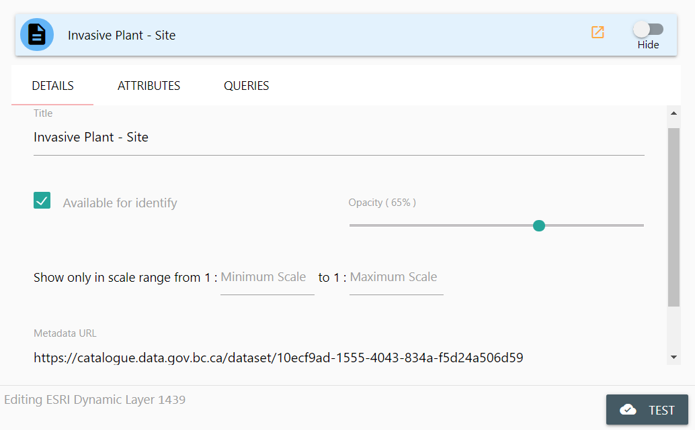

From the DataBC Details panel, you can modify the following attributes:

- Title
- Available for Identify
- Opacity
- Display Range
- Metadata URL

#### Title

`Title` allows you to change the displayed title for the layer in all locations of your application. Click once in the Title text-box and enter your desired layer title.

#### Available for Identify

`Avaiable for Identify` allows this layer to display results in the identify window when a user clicks on the map with the identify tool. If you do not want a layer to be identified (for example, reference layers, boundaries, etc.) disable this check-box by clicking it once.

#### Opacity

`Opacity` adjust how transparent the layer is by default. Making a layer 100% Opaque will prevent users from seeing features covered by this layer. Setting a layer to 0% Opaque will prevent it from displaying on the map at all, but it will still be identifiable and selectable (just invisible).

#### Display Range

`Display Range` allows you to specify an allowable range where this layer can be displayed. If your map is outside of this scale range, the layer will not draw on the map, and will not be identifiable or selectable.

#### Metadata URL

`Metadata URL` is the DataBC Catalog URL for the layer. This is automatically inserted when importing a layer from the DataBC Catalog, and should only be modified if the default Catalog URL has changed, or you specifically want metadata for this layer to redirect to a unique location. To change the metadata url, click once in the text-box and supply a new URL value.

### WMS Details

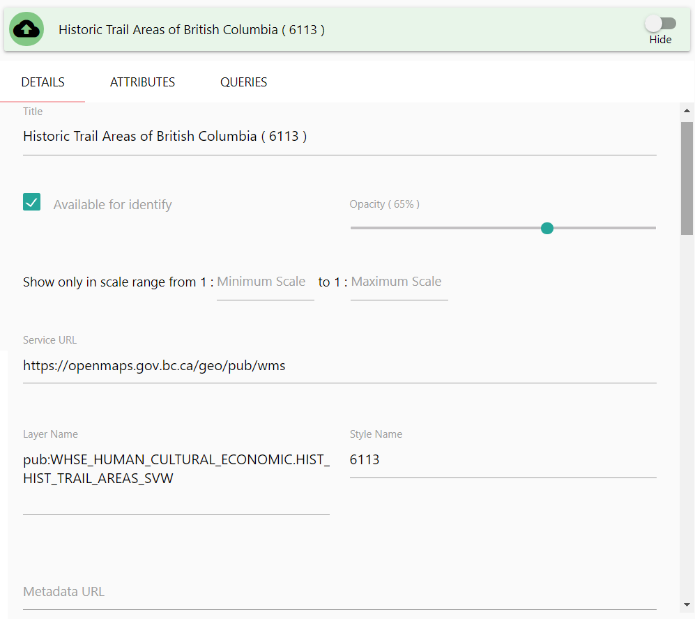

From the WMS Details panel, you can modify the following attributes:

- Title
- Available for Identify
- Opacity
- Display Range
- Service URL
- Layer Name
- Style Name
- Metadata URL

#### Title

`Title` allows you to change the displayed title for the layer in all locations of your application. Click once in the Title text-box and enter your desired layer title.

#### Available for Identify

`Avaiable for Identify` allows this layer to display results in the identify window when a user clicks on the map with the identify tool. If you do not want a layer to be identified (for example, reference layers, boundaries, etc.) disable this check-box by clicking it once.

#### Opacity

`Opacity` adjusts how transparent the layer is by default. Making a layer 100% Opaque will prevent users from seeing feaures covered by this layer. Setting a layer to 0% Opaque will prevent it from displaying on the map at all, but it will still be identifiable and selectable (just invisible).

#### Display Range

`Display Range` allows you to specify an allowable range where this layer can be displayed. If your map is outside of this scale range, the layer will not draw on the map, and will not be identifiable or selectable.

#### Service URL

`Service URL` Is the URL for the WMS Service, not including any GetCapabilities attributes or other query parameters. This will likely only change if the WMS Service URL has been updated.

#### Layer Name

`Layer Name` Is the name of the WMS Service layer you are presenting to your users. This should not be modified unless you are certain of a change to source layer names (confirmed by a review of the WMS Service GetCapabilities). Usually, it's easier to simply re-add the layer.

#### Style Name

`Style Name` is the name of the WMS Service layer style you are presenting to your users. This should not be modified unless you are certain of a change to source layer styles (confirmed by a review of the WMS Service GetCapabilities). Usually, it's easier to simply re-add the layer.

#### Metadata URL

`Metadata URL` is a supplied URL for the layers metadata. By default this is empty for WMS layers, but can be supplied if desired. This is useful for providing users with links to data sources or specific external resources related to the data displayed in your application.

### Vector Layer Details

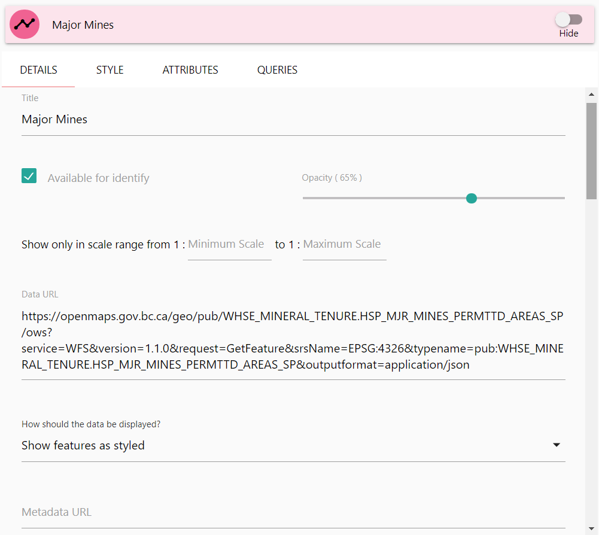

From the Vector Details panel, you can modify the following attributes:

- Title
- Available for Identify
- Opacity
- Display Range
- How should the Data be Displayed?
- Show Cluster Bounds on Hover 
- Data URL
- Metadata URL

Note that the Vector Details panel is the same if you've imported vector data directly into your application, or if you're using a URL.

#### Title

`Title` allows you to change the displayed title for the layer in all locations of your application. Click once in the Title text-box and enter your desired layer title.

#### Available for Identify

`Avaiable for Identify` allows this layer to display results in the identify window when a user clicks on the map with the identify tool. If you do not want a layer to be identified (for example, reference layers, boundaries, etc.) disable this check-box by clicking it once.

#### Opacity

`Opacity` adjusts how transparent the layer is by default. Making a layer 100% Opaque will prevent users from seeing feaures covered by this layer. Setting a layer to 0% Opaque will prevent it from displaying on the map at all, but it will still be identifiable and selectable (just invisible).

#### Display Range

`Display Range` allows you to specify an allowable range where this layer can be displayed. If your map is outside of this scale range, the layer will not draw on the map, and will not be identifiable or selectable.

#### How should the Data be Displayed

`How should the Data be Displayed?` is a styling override for your vector data. This is a dropdown select box that contains three options:

- Show Feature as Styled (Default)
- Show Features in Clusters
- Show Features as a Heatmap

`Show Feature as Styled` will use the supplied vector styling for the layer. This is the default setting for vector layers.

`Show Features in Clusters` will still use your default layer styling, but it will show the features clustered on the map, expanding them as you zoom in. This is very useful for dense sets of vector point data.

`Show Features as a Heatmap` will remove your default styling and convert the data into a heatmap display. This is very useful for point data sets.

#### Show Cluster Bounds on Hover 

`Show Cluster Bounds on Hover` shows the bounds of a cluster's markers when you mouse over the cluster.  

> __Note:__ This option only appears when `Show Features in Clusters` is selected for `How should the Data be Displayed?`.

#### Data URL

`Data URL` is the URL location for your vector data. If you've imported a vector file into your application, this will be a local path to your applications source folder. Do not modify this URL unless you are sure you want to direct the application to search a specific location for the vector data.

#### Metadata URL

`Metadata URL` is a supplied URL for the layers metadata. By default this is empty for WMS layers, but can be supplied if desired. This is useful for providing users with links to data sources or specific external resources related to the data displayed in your application.

### Vector Styling

Unlike other layer type, Vector layers can have customizable styling. To view an change a vector layers styling, click once on the `Style` tab header.

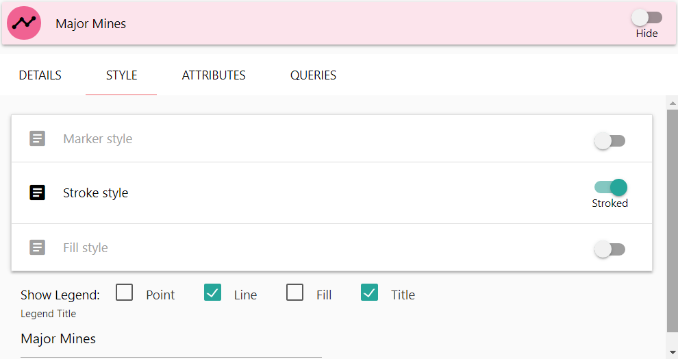

Vectors have three primary categories for editing style information, depending on the source geometry type:

- Marker style (Point Data)
- Stroke style (Line Data)
- Fill style (Polygon Data)

In addition, you can specify the style for the legend, which by default will be set to match your data style. You can also update the legend title if you want it to display differently from your layer title.

If you wish to apply other style types to a vector (for instance, using markers for a lines point coordinates), you can enable those specific style options by clicking once on the toggle buttons on the right of the style tiles. Note however that some styles, like for instance fill styles, will have little effect on some data types.

#### Marker Style

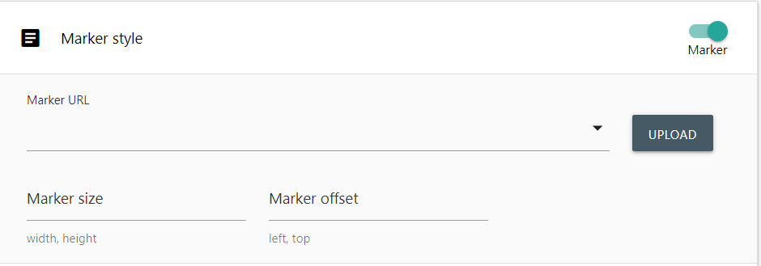

Marker styles require a marker image, a Marker size, and a marker offset.

To add a marker image to your application, click once on the `Upload` button. This will open your operating system's standard file selection dialog. Select a file to import it into your application. Once imported, your marker image will be available to select in the `Marker URL` dropdown selection box.

`Marker Size` allows you to specify the size of the image in pixels as it will display on the map. Images that are larger then the specified size will shrink to match, smaller images will be stretched.

`Marker Offset` specifies an offset size in pixels to shift your marker over. Generally a marker will draw on the map with the images top left corner on the point. If you want to centre your marker, supply an offset of half the marker size. As different markers and sizes have different offset needs, this value is not defaulted.

#### Stroke Style

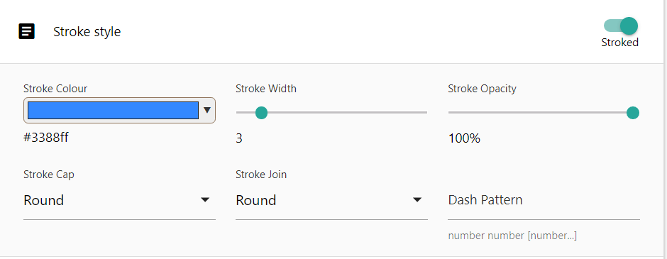

Stroke styles are the styling for linework for your vector data. This includes the perimeter of polygons as well as non-marker points.

`Stroke Colour` will set the colour to use for your linework. Click once on the selector box to open a colour selector.

`Stroke Width` will set the thickness of your linework. Click and hold your mouse button down on the slider, and drag your mouse left or right to adjust the thickness of your line.

`Stroke Opacity` will set the transparency of your linework. Click and hold your mouse button down on the slider, and drag your mouse left or right to adjust the opacity of the line.

`Stroke Cap` is the end-style of the line. You can specify the line ends to be the following styles:

- Butt
- Round
- Square

Click once on the Stroke Cap dropdown select box to display the possible values and select one. The Default value is `Round`

`Stroke Join` is the style used where lines connect, for example the vertices along a polygons perimeter. You can specify the following styles:

- Miter
- Round
- Bevel

Click once on the Stroke Join dropdown select box to display the possible values and select one. The Default value is `Round`

`Dash Pattern` is used if you want your linework to appear dashed or dotted, rather than a solid single line. These are numeric values indicating the size of the dashes. For example `20, 20` will create line dashes 20 pixels in size, with a 20 pixel gap between them.

#### Fill Style

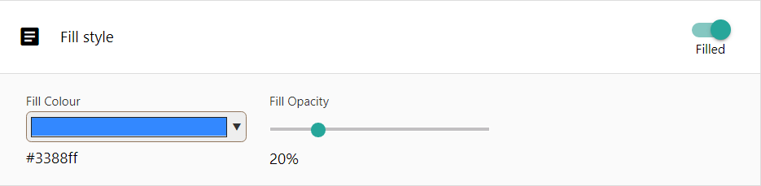

Fill styles supply styling for the interior of your vector features. Fill styles are much simpler than the other style types. 

`Fill Colour` will set the colour to use for your fill. Click once on the selector box to open a colour selector.

`Fill Opacity` will set the transparency to use for your fill. Click once and hold your mouse button down on the slider, and drag your mouse left or right to adjust the level of opacity desired.

### Attributes

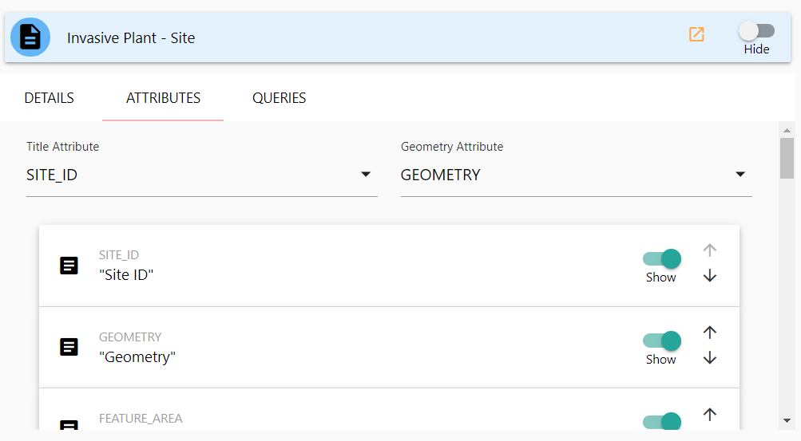

To view the attribute edit panel of the Layer edit popup, click once on the `Attributes` tab header. The attributes details screen contains several customizable options that affect the behavior of your layer when identified or displaying data.

#### Title Attribute

`Title Attribute` is a dropdown selection box that allows you to specify which attribute will be used as a display title for the layer. Click once in the dropdown selection box to see list of all available attributes and choose the one best suited for a display label for your layer. Often this is a unique name or human-readable identifier.

#### Geometry Attribute

`Geometry Attribute` Specifies which attribute contains the geometry information for the layer. As some layers may contain multiple geometry attributes, you must select the one you wish to use. If your layer only contains one, it will default to that attribute.

#### The Attribute List

Below the two dropdown selection boxes you'll find the listing of all available attributes for the layer. Each attribute will have an expandable tile that contains a number of additional attribute-specific options.

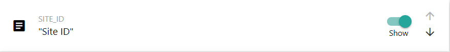

The `Show` toggle will set this attribute to display or stay hidden. Click the toggle once to change whether or not it should display on identify results. Note that you should ensure you do not hide your title attribute!

To the far right of the tile are the up-down arrow buttons. These are used for changing the displayed attribute order. Click once on the up or down arrows to adjust where this attribute should display in order.

To expand the attribute tile, click once anywhere on the tile. It will expand and display additional configuration options for the attribute. Currently, we only modify the Title.

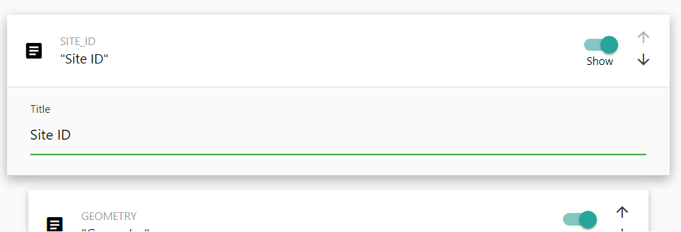

To modify the title, click once on the Title text box and enter your new title to display. By default, SMK will determine a Human-readable title by converting the name of the attribute, but as this may not be correct it's recommended to review your attribute titles and adjust any that may be incorrect.

Once you have finished modifying the attribute configurations, click once on the tile header to close the expanded tile.

> __IMPORTANT:__ Do not set your geometry column to hidden. This will prevent SMK from being able to access your geometry column and no data will be displayed or identifiable on your map. The Geometry column is not appended to Identify results, so there's no need to hide it.

### Queries

Queries are a powerful tool that enable customized search and filtering queries for a layer. SMK-CLI ha the capability to enable a user to generate very complex queries, but some options are limited. A developer with a strong understanding of json and the SMK query framework can extend your queries if a particular function is needed but unavailable by the SMK-CLI editor.

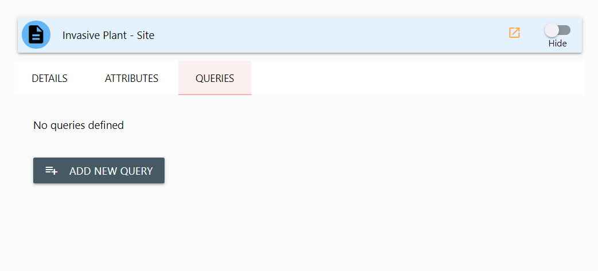

Activate the Layer Query panel by clicking once on the `Queries` tab header. If this layer has no queries, it will be blank.

To create a new query, click once on the `Add New Query` button. A new query tile will be added to the Query Panel.

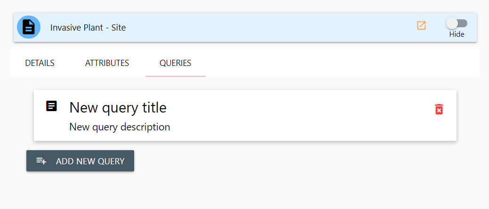

You can delete a query by clicking once on the red delete icon to the far right of the query tile. You can edit the query details by clicking once anywhere on the query tile. It will be expanded and display the editable options for your query.

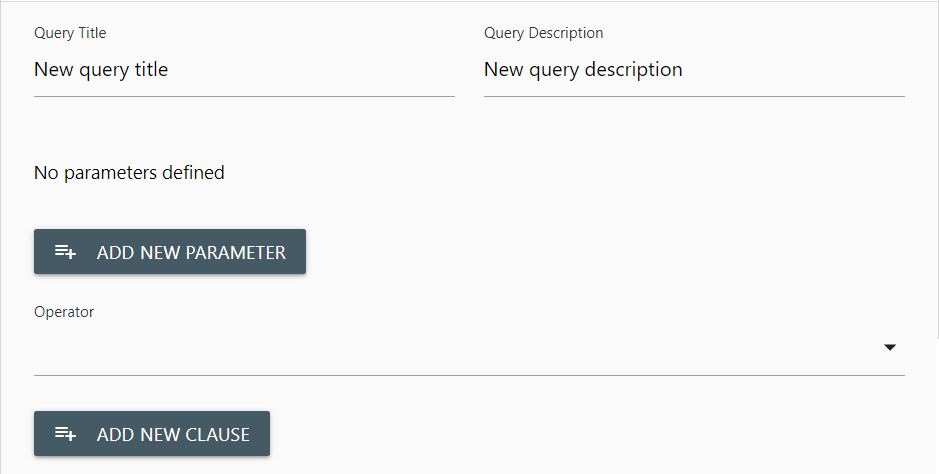

From the query edit panel you can modify the displayed Query Title and Query Description. Click once in the text boxes to make your desired changes.

#### Parameters

Queries function from Parameters, operator, and Clauses. You must include at least one Parameter, specify the Operator and at least one Clause into your query for it to produce results.

Think of a parameter as your entry field. The parameter will be displayed to the user and allow them to enter values to use for the query.

To add a parameter. Click once in the `Add New Parameter` button. A query parameter tile will be added to your query. Click once anywhere in the tile to expand it for editing.

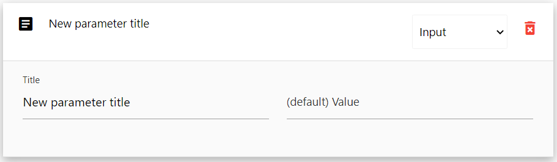

There are three default options for editing a parameter:

- Type
- Title
- Default Value

#### Type

`Type` is a dropdown select box on your parameter tile header. Click once in the dropdown select box to expand it and choose the type of input parameter you want to use. There are four possible parameter types

- Constant
- Input
- Select
- Select Unique

`Constant` sets this parameter to always have a fixed value. Users cannot change this value, though it will be displayed on the query panel in your application.

`Input` is a text box entry field. Users are able to type any text into this box for the query to use.

`Select` is a dropdown select box. The users of your application will be presented with a dropdown selection that they can choose values from, but they cannot type their own values.

`Select Unique` is also a dropdown select box. It functions the same as `Select`, but enforces single selection of unique values.

#### Title

`Title` is a text box containing the displayed title of your parameter. This title is displayed to the user and it's recommended to use a concise, but informative title describing what detail the user is expected to provide to the query.

#### Default Value

`Default Value` is the pre-set default value that will be supplied to this parameter so users do not have to fill in or select the parameter. `Constant` types required a default, but other types do not.

### Operator

Below the `Parameter` listing and `Add New Parameter` button is a dropdown select box for choosing your queries Operator.

The Operator defines the method of query, and contains three options:

- AND
- OR
- NOT

#### AND

`AND` Queries indicate that the query should return results that match for all supplied parameter conditions. This will result in queries that return fewer results.

#### OR

`Or` Queries indicate that the query should return results for any one of the parameter conditions. This will result in queries with a larger volume of results.

#### NOT

`Not` Queries indicate that the query should return values that do not match any of the parameter conditions. Instead, this returns results that are not matches. This is useful for exclusion filters.

### Clause

The Query Clause defines the actual query-able field. Clauses are attached to parameters. To add a new clause to your query, click once on the `Add New Clause` button.

Select your Parameter, the related Attribute and specify the clause.

## Custom Identify displays

It is possible to completely customize your layers Identify popup display. This is an advanced feature that requires a working understanding of the Vue.js framework, HTML and potentially some javascript knowledge. More details on providing custom popups will be made available in the future.

> Query documentation and functionality is currently in progress, check back for further updates soon!

[Creating an SMK application with the CLI](create-an-app.md) |
[Editing an SMK application with the CLI](edit-an-app.md) |
[Back to Index](index.md)

---

