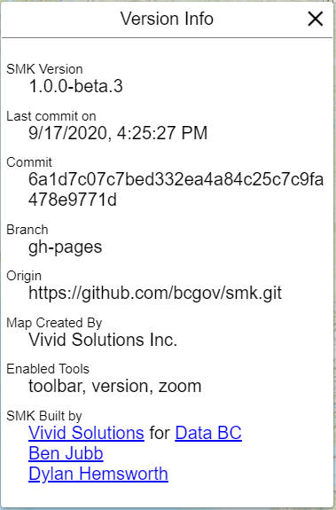

# Editing a Tool

Several tools have unique configurations that allow you to tailor their behaviour to your applications needs. Tools that can be edited are:

- [About](#about)
- [Base Maps](#base-maps)
- [Bespoke](#bespoke)
- [Directions](#directions)
- [Geomark](#geomark)
- [Identify](#identify)
- [Layers](#layers)
- [List Menu](#list-menu)
- [Measure](#measure)
- [Scale](#scale)
- [Search](#search)
- [Select](#select)
- [Version](#version)
- [Zoom](#zoom)

## Common settings

Almost all tools share a common set of default settings. Some tools will only have these options, while others may have additional advanced configurations.

### Title

`Title` Allows you to change the title that is displayed in the panel. Click once in the text box and modify the text as needed. Defaults to "Base Maps"

### Position

`Position` Allows you to change where the base maps panel can be activated from. Click once in the dropdown selector to be presented with a list of available options. You can position your panel in the following locations:

- list-menu
- shortcut-menu
- toolbar

> __Note:__ This may depend on other tool settings. For instance, if you have not activated the shortcut menu tool, setting shortcut-menu as the position will not work. Ensure you've activated the corresponding menu tools before modifying this configuration

### Order

`Order` Allows you to change the order in which the tool will be added to it's selected position. Use this if you want to move a tools activation button to a different position.

### Show title in Toolbar

`Show title in Toolbar` Allows you to specify if you want the title to be displayed in the toolbar. This is set to `false` by default. Be careful of setting this on screens with many buttons, or on mobile devices.

### Set Icon

`Set Icon` Allows you to specify a different icon for the toolbar button. SMK uses the Google Material Icon set. Click once on the Set Icon button to open a panel with all available icons. Select any icon desired, and click once anywhere outside of the panel to close the popup window.

## About

The `About` tool adds an "about" panel to your application where you can include details describing your application and what information it provides to users.

The About tool contains a `Contents` section, where you can supply HTML Markup content. This will then be displayed to the user when they view the about content in the application.

## Base Maps

The `Base Maps` tool adds a base map selection panel to your application. From this panel, you can change the currently visible base map from within the application.

In Additional to the default settings for a tool,  Base map configuration has two additional options you can configure:

- Select which base maps are available
- Appearance of base map tiles in panel

Please review `Common settings` above. Below are Base Map specific Settings.

### Select which base maps are available

`Select which base maps are available` Allows you to specify your list of selectable base maps from the SMK list of base map options. Click once on any check-box to add or remove it from your base map list. This will not affect your selection of default base map for you application.

### Appearance of base map tiles in panel

`Appearance of base map tiles in panel` Allows you to alter the appearance of the base map tiles in the base map panel. You can alter the width and height of the tiles in pixels. The default settings will create base map tiles in a square of 110x110 pixels.

## Bespoke

Bespoke is a special tool that "holds" other accessible tool data. Specifically, this is used for custom tools, and the layer specific search, query and filter tools. When you create a Search/Filter/Query on a layer, a `Bespoke` is generated automatically. Your application can have many of these tools.

Please review `Common settings` above. The `Bespoke` tool does not have any additional special configurations.

## Directions

The Directions tool allows access to the DataBC GeoLocation API for creating routes and route-planning. This is a highly customizable tool with a number of specialized options depending on the type of routes you wish to create.

> __Note:__ To use the API, you will need to be provided with an API key from DataBC. An API key is not included with SMK.

In Addtional to the default settings for a tool, you can specify the following options for the route planner:

- Route Optimization
- Route Traveled
- Route Criteria
- Vehicle Type
- Truck Route Adherence
- Truck Height
- Truck Width
- Truck Length
- Truck Weight

### Route Optimization

`Route Optimization` Allows you to specify if you want the route planner API to find the optimal route by default. Additionally, there's an option to present this toggle to the user, so they can change the default setting in the application.

### Route Traveled

`Route Travelled` Allows you to specify if the route planner API should determine a round-trip route or a direct route. Additionally, there's an option to present this toggle to the user, so they can change the default setting in the application.

### Route Criteria

`Route Criteria` Allows you to specify if the route planner API should determine a route by the shortest overall distance, or the fastest possible route. Additionally, there's an option to present this toggle to the user, so they can change the default setting in the application.

### Vehicle Type

`Vehicle Type` Allows you to specify if the route planner API should determine a route optimized for general personal automobiles or industrial transport and freight trucks. Additionally, there's an option to present this toggle to the user, so they can change the default setting in the application.

> __Note:__ The following settings are specific to planning routes for Freight Trucks. If you do not intend to allow route planning for these vehicles, you can ignore and disable the following settings.

### Truck Route Adherence

`Truck Route Adherence` Allows you to specify if the route planner API should determine a route that strictly adheres to recognized trucking routes. Additionally, there's an option to present this toggle to the user, so they can change the default setting in the application.

### Truck Height

`Truck Height` Allows you to specify if the default truck height in metres that the route planner API will use to calculate optimal trucking routes. Additionally, there's an option to present this toggle to the user, so they can change the default setting in the application.

### Truck Width

`Truck Width` Allows you to specify if the default truck width in metres that the route planner API will use to calculate optimal trucking routes. Additionally, there's an option to present this toggle to the user, so they can change the default setting in the application.

### Truck Length

`Truck Length` Allows you to specify if the default truck length in metres that the route planner API will use to calculate optimal trucking routes. Additionally, there's an option to present this toggle to the user, so they can change the default setting in the application.

### Truck Weight

`Truck Weight` Allows you to specify if the default truck height in kilograms that the route planner API will use to calculate optimal trucking routes. Additionally, there's an option to present this toggle to the user, so they can change the default setting in the application.

> __Tip:__ Though intended for large freight trucks, the truck specific options may also be useful for assisting recreational vehicles, buses and other over-sized vehicles in planning optimal routes.

## Geomark

The Geomark tool allows creating and loading a geomark, which is an area of interest that is stored in a service and can be shared by a URL. A geomark can be created in SMK by drawing one or more polygons and saving the drawing as a geomark. A geomark can also be loaded by its URL.

### Geomark Service URL

`Geomark Service URL` is the address of the Geomark service used. The production service URL is used as a default, but a user may specify an alternative service URL.

## Identify

The Identify tool allows users to receive attribute details about layers in your application by clicking on the map. See [Edit Layers](edit-layer.md) for information on settings visible attributes and allowing a layer to be identifiable.

In addition to the default settings, Identify has several unique customizable options:

- Allow add to selection
- Allow search near current location
- Show in toolbar
- Allow entry of search radius
- Allow changing search radius units
- Search Radius
- Search Radius Units

### Allow add to selection

`Allow add to selection` Allows the user to add any identified feature to a selection set. Selection can be used as a temporary storage for data, or by custom tools for various options.

### Allow search near current location

`Allow search near current location` Will trigger an identify around your current location, rather then specifying a location by clicking on the map.

### Show in toolbar

`Show in toolbar` Will include a toolbar icon for activating the Identify tool.

### Allow entry of search radius

`Allow entry of search radius` Allows the user to specify a search radius to increase the possible identified results coming back from a search.

### Allow changing search radius units

`Allow changing search radius units` Allows the user to change the search radius units for radius searches

### Search Radius

`Search Radius` Sets the default search radius to use

### Search Radius Units

`Search Radius Units` Sets the default search radius units to use. Available options are:

- Pixels
- Metres
- Kilometres

## Layers

The Layers tool enables a layer activation panel for your application. This panel allows users to turn layer visibility on and off and toggle legend icons

In addition to the default settings, Identify has several unique customizable options:

- Allow filtering layer list
- Show legend toggle
- Show 'All Layers' visibility toggle
- Set layer Visible icon
- Set layer Hidden icon

### Allow filtering layer list

`Allow filtering layer list` Allows the user to filter the layer listing to search for a specific layer they wish to set visibility or view the legend for. This tool is especially useful for applications with a large volume of layers.

### Show legend toggle

`Show legend toggle` activates a toggle on the layer panel to show or hide the layer legend.

### Show 'All Layers' visibility toggle

`Show All Layers visibility toggle` activates a toggle that allows users to set all layers to visible or hidden with a single click. Not recommended for applications with a large volume of layers.

### Set layer visible icon

`Set layer visible icon` Will open the icon selection popup, allowing you to change the default icon shown for visible layers

### Set layer hidden icon

`Set layer hidden icon` Will open the icon selection popup, allowing you to change the default icon shown for hidden layers

## List Menu

List Menu enables the "hamburger" menu option that displays on the top-left of the SMK application. When active, you can place any of your tools within this menu as an alternative to using the shortcut or toolbar menu options.

List menu allows you to modify the common settings for tools only.

## Measure

The Measure tool adds a measure utility to your application that allows users to make distance and area measurements on your map. See the [SMK Documentation](https://bcgov.github.io/smk/) for more details.

Measure tool allows you to modify the common settings for tools only.

## Scale

The Scale tool adds a scalebar to the bottom right corner of your application.

The scale tool has several unique customizable options:

- Show Scale Factor
- Show Scale Bar
- Show Zoom Level

### Show Scale Factor

`Show Scale Factor` Adds a display for the current maps scale factor.

### Show Scale Bar

`Show Scale Bar` Adds a display for a scalebar for the current maps scale factor, units adjusted based on zoom level (Kilometres, metres).

### Show Zoom Level

`Show Zoom Level` Adds a display for the current map zoom level.

## Search

The Search tool adds a search bar to the top left side of your application, allowing users to access the DataBC geocoder search results, for address and location searches.

In addition to the default settings, Search has two additional customizable options:

- Show Results in a Panel
- Show Selected Location in Panel

### Show Results in a Panel

`Show Results in a Panel` Will add the search results listing to a panel that displays after entering a search.

### Show Selected Location in Panel

`Show Selected Location in Panel` Will show details about your current selected search result in the search panel.

## Select

The Select tool allows users to make selections from identified data on your map. This tool works in concert with the Identify tool for creating your selection sets.

In addition to the default settings, Select has two additional customizable options:

- Show Clear Command
- Show Remove Command

### Show Clear Command

`Show Clear Command` Adds a button to the Select panel that enables the user to clear all current selections.

### Show Remove Command

`Show Remove Command` Adds a button to the Select Panel selected layers that enables a user to remove a selection.

## Version

The Version tool adds a panel to your application that displays SMK specific version information. This is primarily used for debug information and not typically added to a production-ready application.

## Zoom

The Zoom tool enables zooming functionality for your application, either by drawing a box, the mouse scroll wheel, double-click, or by using the zoom buttons on the screen.

The zoom tool contains several customizable options:

- Use Mouse Wheel
- Hold SHIFT to drag a box
- Use Double-Click
- Show Zoom Controls

### Use Mouse Wheel

`Use Mouse Wheel` Enables the user to zoom the map by scrolling their mouse wheel.

### Hold SHIFT to drag a box

`Hold SHIFT to drag a box` Enables the user draw a bounding box on the map by holding the `SHIFT` key and the mouse button down at the same time, and dragging their mouse on the map. When the user releases their mouse button, the map will zoom to the extent of the bounding box drawn.

### Use Double-Click

`Use Double-Click` Enables the user to double-click anywhere on the map to trigger a zoom. Upon double-clicking, the map will zoom one level centred at the place they clicked.

### Show Zoom Controls

`Show Zoom Controls` Adds zoom-in and zoom-out buttons to the top-right corner of the map. Users can click once on the zoom-in or zoom-out buttons to adjust the zoom level of the map.

[Creating an SMK application with the CLI](create-an-app.md) |
[Editing an SMK application with the CLI](edit-an-app.md) |
[Back to Index](index.md)

---

